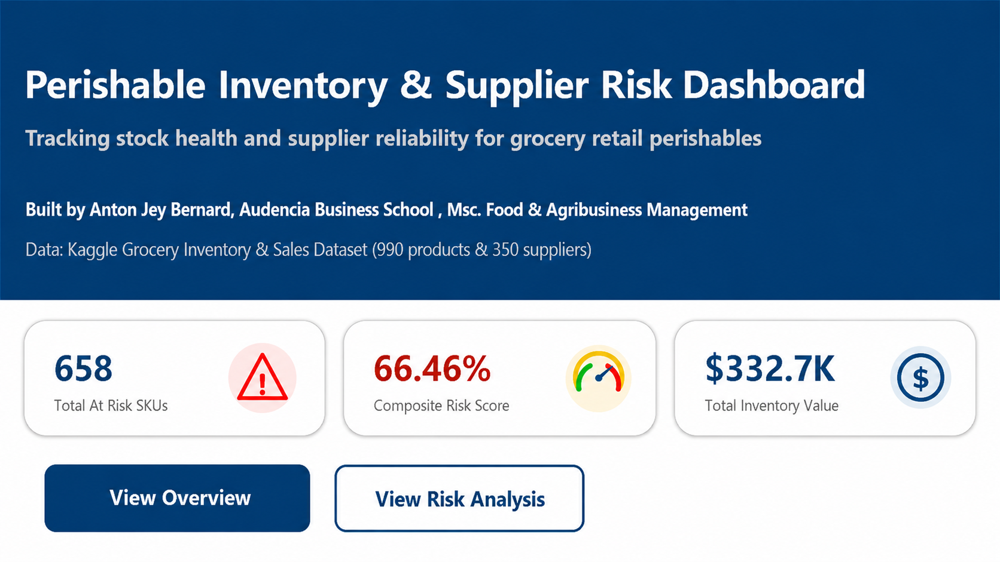
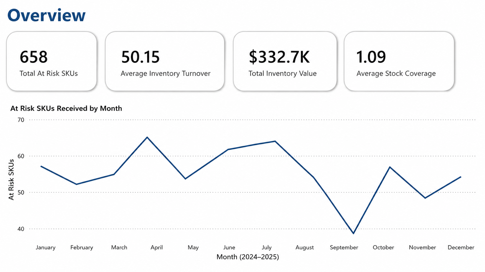
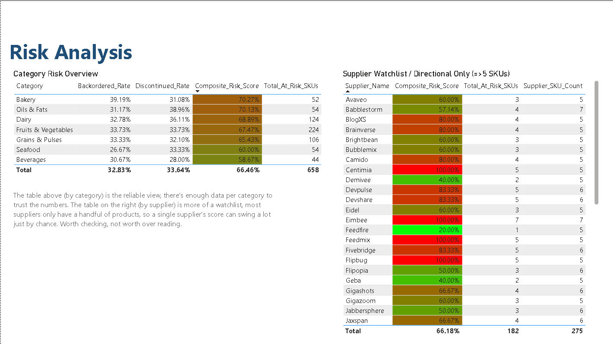

# Perishable Inventory & Supplier Risk Dashboard

**Tool:** Power BI (Power Query, DAX, data modeling)
**Dataset:** [Grocery Inventory and Sales Dataset](https://www.kaggle.com/datasets/salahuddinahmedshuvo/grocery-inventory-and-sales-dataset) (Kaggle, 990 products, 350 suppliers)

## What this is

A dashboard looking at inventory health and supplier reliability for a grocery retailer dealing with perishable goods. The goal wasn't just "what's low on stock", it is connecting that to *why*: which categories and suppliers are actually driving the risk, rather than just showing numbers in isolation.

## Screenshots

### Cover

### Overview

### Risk Analysis

## Cleaning the data (Power Query)

- `Unit_Price` came in as text with a dollar sign (`"$4.50 "`) — converted to a proper Currency type
- `Date_Received`, `Last_Order_Date`, and `Expiration_Date` were all text, not dates. Fixing this took an extra step: the dates were in M/D/Y format but my system locale is D/M/Y, so the default conversion was silently reading them wrong. Had to explicitly set the locale to English (US) during conversion to fix it properly.
- Fixed a typo in the column name (`Catagory` → `Category`)
- One row was missing its Category value, filled it in manually based on the product itself (it was Cabbage, so: Fruits & Vegetables)

## Data model

- Built a separate `DateTable` using `CALENDAR()`, spanning Jan 2023–Dec 2025, with Year/Month/MonthNumber columns added, and marked it as the official date table
- Active relationship from `DateTable[Date]` to `Date_Received`
- Two more relationships to `Last_Order_Date` and `Expiration_Date` exist but are inactive, kept in case they're useful later

## The measures

| Measure | What it does |
|---|---|
| `Average_Stock_Coverage` | Avg. Stock Quantity ÷ Avg. Reorder Level |
| `Backordered_Rate` | % of products currently backordered |
| `Discontinued_Rate` | % of products currently discontinued |
| `Composite_Risk_Score` | Backordered_Rate + Discontinued_Rate (see note below on why this is a sum, not an average) |
| `Total_At_Risk_SKUs` | Count of products that are backordered or discontinued |
| `Avg_Inventory_Turnover` | Average of the dataset's turnover index (see note below) |
| `Total_Inventory_Value` | Sum of Stock Quantity × Unit Price |

## Decisions I had to make along the way

This wasn't a straight build and done process, a few things came up that needed real thinking, and I wanted to document them honestly rather than pretend everything went smoothly.

**I dropped the lead time / late delivery analysis.** My original plan was to calculate lead time as `Date_Received − Last_Order_Date`, assuming Last_Order_Date meant "when this specific delivery was ordered." Once I tested it, I got a bunch of negative values — deliveries seemingly arriving before they were ordered. That told me Last_Order_Date is probably just "the most recent time this product was reordered," not tied to any specific row. Rather than force a metric that didn't actually mean what I wanted it to mean, I dropped it and rebuilt supplier risk around fields the data could actually support i.e Status and Inventory_Turnover_Rate.

**I had to fix the Composite Risk Score formula partway through.** My first version averaged Backordered_Rate and Discontinued_Rate together. Problem is, since both rates come from the same three-way split (Active / Backordered / Discontinued), they can never add up to more than 100% so the average is mathematically capped at 50%. That caused a big cluster of suppliers to all tie at exactly 50%, which flattened the whole ranking. Fix was simple once I saw it: just sum the two rates instead of averaging them. That removed the artificial ceiling and gave a real spread of scores.

**I moved supplier level risk to a secondary, clearly labeled view.** With 990 products across 350 suppliers, most suppliers only have 2-3 products each which means a percentage based risk score for any individual supplier can swing wildly just from random chance (one bad product out of two looks identical to a genuinely unreliable supplier). So the main risk analysis is done at the category level instead, where sample sizes are actually big enough to trust (44-224 products per category). The supplier data is still there, but as a "watchlist" filtered to suppliers with 5+ products, and labeled directional only useful for flagging specific names to look into, not a precise ranking.

**Inventory_Turnover_Rate is treated as relative, not literal.** The values in the dataset range roughly 1-99, which doesn't match how a real turnover ratio usually behaves (that would imply some products turning over almost 100 times a year, which isn't realistic for grocery). I'm treating it as a relative indicator of how fast something moves, not a literal annual figure.

## What's in the dashboard

- **Overview page:** four key numbers up top (Total At-Risk SKUs, Avg. Inventory Turnover, Total Inventory Value, Avg. Stock Coverage) plus a monthly trend of at risk SKUs received
- **Risk Analysis page:** a category level risk table (the trustworthy one) and a supplier watchlist (smaller sample, flagged directionally)

## Why I'm writing all this down

Anyone can build a dashboard that looks fine. What I actually want to show here is that I checked whether the numbers meant what I thought they meant before presenting them and was willing to change course partway through when they didn't.
